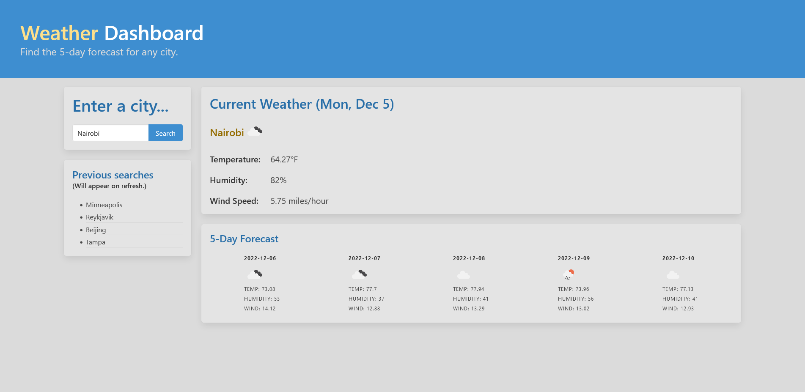

# Weather Dashboard

[Deployed application can be found here.](https://karlnh.github.io/umbrella-carnival)

## Description

This application is a weather dashboard capable of displaying current and future weather conditions of a given city. It was built among other things to practice API fetches in conjunction with dynamic HTML generation and to practice implementation of a non-Bootstrap CSS framework, specifically Bulma.

## Usage

Upon page load the user is prompted with a search box on the left of the screen in which they can enter the name of a city. Once the search button is clicked, they are prompted with possible matches for that city, which they can then select, and the page will load on the right some current weather data as well as a five-day forecast.

The city search is stored and displayed upon page reload in the Previous Searches box on the left. This box is limited to displaying the five most recent searches. These previous searches are clickable and can be used to revisit the current and future weather of that city.

## Credits

Credits to [Bulma](https://bulma.io/), [JQuery](https://jquery.com/), and the free-to-use APIs of [OpenWeatherMap](https://openweathermap.org/). Without them, this project would (in order of appearance) look worse, take more code, and simply not display weather at all.

## License

This project is licensed under the [GNU General Public License v3](https://www.gnu.org/licenses/gpl-3.0.html).
